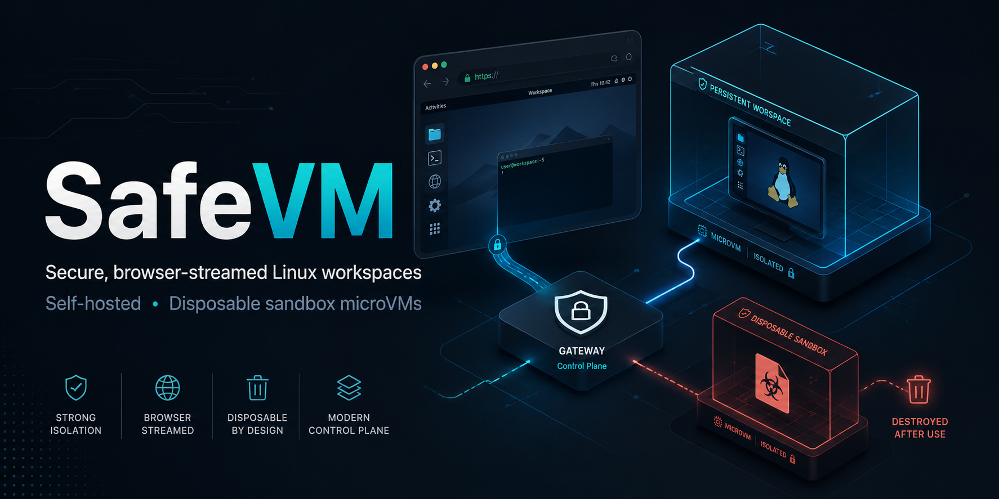

# SafeVM (working name)

<p align="center">
  
</p>

**Secure, browser-streamed Linux workspaces with disposable file-detonation sandboxes.**

Employees work inside an isolated, server-side Ubuntu-style desktop streamed to
their browser — nothing sensitive lives on their personal machine. Risky files
(PDFs, Office docs, unknown executables, archives) open in a **throwaway microVM**
that is destroyed afterward, so malware can't persist or reach the corporate network.

**And the same substrate runs AI agents.** The isolation, egress control, audit, and
live take-over that make a malicious file safe to open are exactly what make it safe
to let an **AI agent operate a full computer** — see [`docs/ai-agents.md`](./docs/ai-agents.md).

> Category: self-hosted, source-available **DaaS** (Desktop-as-a-Service) + **Qubes-style
> disposable VMs**. Think *Kasm Workspaces / Cameyo + Qubes*.

- **Community Edition (this repo):** every core feature — workspaces, disposable
  sandbox, CDR, SSO, policy engine, audit — for a **single organization** (single
  tenant). **Free to run as-is, including commercially.** Source-available under
  the [SafeVM Community License](./LICENSE) — see [License](#license).
- **Cloud (separate, commercial):** the multi-tenant control plane, managed
  autoscaling, billing, SLA. Nothing else is held back.

See [`docs/`](./docs) for the full plan.

---

## Contents

- [Status](#status)
- [Architecture at a glance](#architecture-at-a-glance)
- [Tech stack](#tech-stack)
- [Repository layout](#repository-layout)
- [Deploy to a server (one-liner)](#deploy-to-a-server-one-liner)
- [Local development](#local-development)
- [Update](#update)
- [Troubleshooting](#troubleshooting)
- [Uninstall](#uninstall)
- [License](#license)

---

## Status

🚧 **Phase 1 — MVP workspaces (in progress).** Foundation scaffolded:
control-plane API, node-agent + pluggable isolation runtime, backing services.
Not yet usable end-to-end. See [`docs/roadmap.md`](./docs/roadmap.md).

## Architecture at a glance

```
Browser (thin client, WebRTC/WebSocket)
      │
 [ Gateway ]        auth (OIDC/SAML), TLS, session routing
      │
 [ Control Plane ]  Bun + Elysia API · Prisma/Postgres · Redis · RabbitMQ
      │  (RabbitMQ job bus)
 [ Node Agent ]     per-host daemon, drives the isolation runtime
      │
 ┌────┴──────────────────────────┐
 │ Persistent workspace microVMs  │   user's daily Ubuntu desktop
 │ Disposable sandbox microVMs    │   spawned per risky file, then destroyed
 └────────────────────────────────┘
```

Full detail: [`docs/architecture.md`](./docs/architecture.md).

## Tech stack

| Layer | Choice |
|---|---|
| Runtime / language | **Bun** + TypeScript |
| API framework | **Elysia** |
| ORM / DB | **Prisma** + **PostgreSQL** |
| Cache / presence / pub-sub | **Redis** |
| Job bus (control-plane ↔ agents) | **RabbitMQ** |
| Isolation | pluggable runtime: `mock` (logic) · `docker` (real desktop, Mac-local) · `firecracker` (hardened microVM, Linux+KVM) |
| Web console | **React** + Vite + TanStack Router + shadcn/ui (based on `satnaing/shadcn-admin`) |
| Deploy | single-box Docker Compose / systemd |

## Repository layout

```
packages/
  control-plane/   Elysia API, Prisma schema, queue + redis clients
  node-agent/      RabbitMQ consumer + pluggable isolation runtime (mock | firecracker)
  web/             React dashboard (shadcn/ui) — Workspaces, Sessions, Images, Users, Audit
deploy/
  docker-compose.yml   Postgres + Redis + RabbitMQ
  .env.example
  firecracker/         host setup + image scripts for the microVM runtime (Linux)
  hetzner/             one-command provisioning of a real Firecracker test box
docs/
  architecture.md
  roadmap.md
  os-and-licensing.md
  ai-agents.md         AI agents operating full computers (the differentiator)
  cloud-autoscaling.md on-demand Hetzner capacity (cloud tier)
  decisions.md
```

## Deploy to a server (one-liner)

On a fresh **Ubuntu 22.04 / 24.04** server, install everything (Docker, Bun,
Node.js, the control plane, node-agent, AI-agent runner, and the dashboard behind
nginx) with a single command — it self-clones the repo, generates secrets, runs
migrations, and starts all services as systemd units:

Replace `PUBLIC_ADDR` with your server's IP or domain, then copy-paste:

```bash
curl -fsSL https://raw.githubusercontent.com/Altailab/safevm/main/deploy/install-ubuntu.sh \
  | sudo PUBLIC_ADDR=YOUR_SERVER_IP bash
```

That's all you need. The admin login + password are printed at the end.

### Optional options

Prepend any of these before `bash` (e.g. `... PUBLIC_ADDR=1.2.3.4 SEED_ADMIN_EMAIL=you@co.com bash`):

| Variable | Default | What it does |
|---|---|---|
| `PUBLIC_ADDR` | auto-detected public IP | Domain or IP the browser uses (also tags desktop URLs) |
| `HTTP_PORT` | `80` | Plain-HTTP port nginx listens on (e.g. `8000`) |
| `TLS_EMAIL` | _(none)_ | **Domain only** — gets a Let's Encrypt cert and serves HTTPS on **443**. Can't be used with a bare IP. |
| `SEED_ADMIN_EMAIL` | `admin@safevm.local` | First admin login |
| `SEED_ADMIN_PASSWORD` | generated (printed at end) | First admin password |
| `RUNTIME` | `docker` | Isolation tier: `docker` · `mock` · `firecracker` (Linux+KVM) |
| `WEBTOP_IMAGE` | `lscr.io/linuxserver/webtop:ubuntu-xfce` | Desktop container image |
| `APP_USER` | invoking sudo user | Unix user that owns/runs the services |
| `INSTALL_DIR` | `/opt/safevm` | Where the repo is cloned |
| `SAFEVM_REPO` | `https://github.com/Altailab/safevm.git` | Repo to clone |
| `SAFEVM_REF` | `main` | Branch/tag to install |

> **HTTPS needs a domain.** Let's Encrypt can't issue certificates for bare IPs.
> For TLS, point a DNS record at the box and use
> `PUBLIC_ADDR=desktops.yourdomain.com TLS_EMAIL=you@yourdomain.com` (no `HTTP_PORT`).

Example with a few options — plain HTTP on a custom port:

```bash
curl -fsSL https://raw.githubusercontent.com/Altailab/safevm/main/deploy/install-ubuntu.sh \
  | sudo PUBLIC_ADDR=YOUR_SERVER_IP HTTP_PORT=8000 SEED_ADMIN_EMAIL=admin@example.com bash
```

See [`deploy/install-ubuntu.sh`](./deploy/install-ubuntu.sh) for post-install
hardening notes.

When it finishes, the script prints how to reach the install:

```
Dashboard:  http://<PUBLIC_ADDR>        (port 80, or 443 with TLS_EMAIL)
Login:      <SEED_ADMIN_EMAIL>
Password:   <printed / generated>
```

The dashboard is served by nginx on **`HTTP_PORT`** (default **80**; HTTPS on
**443** if you set `TLS_EMAIL`); the API is reverse-proxied on the same origin, so
there's no extra port to open. Check the services any time with
`systemctl status safevm-control-plane safevm-node-agent safevm-agent`.

## Local development

> Firecracker requires **Linux + KVM** and does **not** run on macOS. On a Mac,
> the control plane, web, and node-agent all run natively against the backing
> services using `RUNTIME=mock` (no real VM). The Firecracker runtime is
> developed against a Linux host. See [`docs/os-and-licensing.md`](./docs/os-and-licensing.md).

```bash
# 1. backing services
cp deploy/.env.example .env
docker compose -f deploy/docker-compose.yml up -d

# 2. install + generate Prisma client
bun install
bun run db:generate
bun run db:migrate     # creates the schema

# 3. run the services (separate terminals)
bun run dev:cp         # control plane  -> :3001
bun run dev:agent      # node agent     (RUNTIME=mock | docker | firecracker)
bun run dev:web        # dashboard      -> :3000
```

Smoke test:

```bash
curl localhost:3001/health
```

## Update

To roll a server install forward to a new version (run from the box, as root):

```bash
sudo bash /opt/safevm/deploy/update-ubuntu.sh
```

Unlike the installer, this **preserves your config and data**: it keeps `.env`
(so `JWT_SECRET` is unchanged and existing logins stay valid), does **not**
re-seed, and **backs up Postgres** before applying migrations. It pulls the new
code, reinstalls deps, regenerates the Prisma client, rebuilds the dashboard,
applies new migrations, and restarts the services (downtime is just the
migrate + restart window). Flags:

| Flag | Effect |
|---|---|
| `SAFEVM_REF=v1.2.0` | update to a specific branch/tag/commit (default `main`) |
| `SKIP_BACKUP=1` | skip the pre-migration `pg_dump` |
| `FORCE=1` | rebuild even if already on the target version |

The script prints the old→new revision and a rollback hint (and the path to the
DB backup it took) when it finishes.

## Troubleshooting

### Reset / forgot the admin password

If you can't log in (`invalid credentials`) because the admin password was
forgotten or mistyped at install, re-run the seed with a new password. The seed
**upserts**, so it updates the existing admin's password hash in place — no data
is lost:

```bash
cd /opt/safevm/packages/control-plane
set -a; . /opt/safevm/.env; set +a
SEED_ADMIN_EMAIL=admin@example.com SEED_ADMIN_PASSWORD='new-password' \
  /opt/bun/bin/bun run prisma/seed.ts
```

Use your admin email for `SEED_ADMIN_EMAIL`. Then verify it works (should return
a token):

```bash
curl -s localhost:3001/api/auth/login -H 'content-type: application/json' \
  -d '{"email":"admin@example.com","password":"new-password"}'; echo
```

> Tip: avoid shell-special characters (like `@`, `$`, `!`) in passwords passed on
> the command line, or wrap the value in single quotes as shown — otherwise the
> shell can alter it and the seeded password won't match what you type.

### Login fails but the page loads

Test the API directly on the box to isolate the layer:

```bash
systemctl is-active safevm-control-plane          # API up?
curl -s localhost:3001/health                       # control plane healthy?
docker compose -f /opt/safevm/deploy/docker-compose.yml ps   # Postgres/Redis/RabbitMQ up?
journalctl -u safevm-control-plane -n 50 --no-pager # recent errors
```

## Uninstall

To reverse a server install (run from the box, as root):

```bash
sudo bash /opt/safevm/deploy/uninstall-ubuntu.sh
```

This stops and removes the systemd services, all desktop session containers, the
backing services (Postgres/Redis/RabbitMQ), the nginx site, Bun, and the cloned
repo. **Data volumes are kept by default.** Flags:

| Flag | Effect |
|---|---|
| `PURGE_DATA=1` | also delete the Postgres/Redis/RabbitMQ data volumes + the pulled desktop image (**destroys workspace data**) |
| `KEEP_REPO=1` | leave the repo at `/opt/safevm` |
| `REMOVE_DOCKER=1` | also apt-purge Docker Engine + its apt repo/key |
| `REMOVE_NGINX=1` | also apt-purge nginx |
| `REMOVE_NODE=1` | also apt-purge Node.js (installed for the Prisma CLI) |

Full wipe (everything install-ubuntu.sh touched, including data and Docker):

```bash
sudo PURGE_DATA=1 REMOVE_DOCKER=1 REMOVE_NGINX=1 REMOVE_NODE=1 bash /opt/safevm/deploy/uninstall-ubuntu.sh
```

## License

SafeVM is owned by **Rufat Mammadli, founder of Altailab LLC** and licensed under
the **[SafeVM Community License](./LICENSE)** — a source-available license:

- ✅ **Free to use, including commercially**, when you run the **unmodified**
  Community Edition (the limited, single-tenant feature set in this repo).
- 🚫 **Commercial use of a _modified_ version requires a commercial license** from
  Altailab LLC. Modified versions are otherwise free for non-commercial use.

For a commercial license (modified-version use, enterprise terms, or the
multi-tenant Cloud Edition), contact Altailab LLC via the
[project repository](https://github.com/Altailab/safevm).

Note that **guest OS images** shipped or built by SafeVM carry their own component
licenses (the Linux kernel is GPLv2); those are independent of the SafeVM
Community License. See [`docs/os-and-licensing.md`](./docs/os-and-licensing.md).
